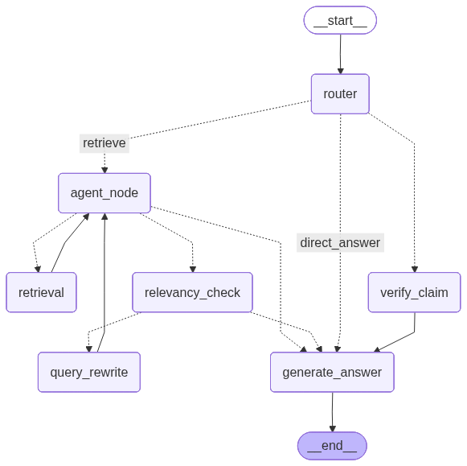

<div align="center">

# PaperCohort


PaperCohort is an agentic RAG system that lets you load research papers from any source and interrogate them through conversation — asking questions, stress-testing claims against newer literature, and pulling in live web context when the paper alone isn't enough.

Built with LangGraph · LangChain · Qdrant · Streamlit

</div>

---

## The Problem It Solves

Academic papers are dense, cross-referenced, and time-consuming. PaperCohort collapses three painful workflows into one interface:

- **Comprehension** — ask anything about a paper in plain language
- **Fact-checking** — find out if a claim from a 2021 paper still holds in 2025
- **Discovery** — get live web and ArXiv context without leaving the app

---

## How It Works

Every message you send is classified by an LLM router before anything else happens. Based on your intent, one of three execution paths kicks in:




No single retrieval strategy handles all query types well. Routing lets each path be purpose-built.

---

## Loading Papers

Three ways to bring papers in — all available from the sidebar:

| Method | Input |
|---|---|
| File upload | PDF, TXT, or Markdown — drag and drop |
| Web URL | Paste one or more URLs, one per line |
| ArXiv | Title keyword or ID directly (e.g. `2303.08774`) |

Each session maintains its own isolated paper collection. Papers loaded in one session are invisible to another.

---

## Talking to Your Papers

Once papers are loaded, just type. PaperCohort figures out what you're trying to do:

```
# Deep-dive a specific paper
"Walk me through the experimental setup in section 4."

# Probe a claim
"Verify the claim that sparse attention is sufficient for long-range dependencies."

# Ask about the field broadly
"What's changed in diffusion model research since 2022?"

# Something completely off-topic, without polluting your session
/btw What's the difference between PPO and GRPO?
```

The `/btw` prefix is a side-channel for throwaway questions. The LLM answers (or searches the web) but nothing gets saved to your session history — your paper context stays clean.

---

## Sessions

PaperCohort supports multiple simultaneous sessions, each fully independent:

- Session titles are auto-generated from your first message (no manual naming)
- State persists across restarts — close the tab, come back, pick up where you left off
- Each session gets its own Qdrant vector collection (`papercohort_{session_id}`) and its own SQLite conversation thread

---

## Setup

PaperCohort uses [uv](https://github.com/astral-sh/uv) for dependency management.

```bash
git clone <repo-url>
cd papercohort
uv sync
cp .env.example .env   # fill in your keys
uv run streamlit run app.py
```

### API Keys

Four services are required. Add them to your `.env`:

```env
OPENAI_API_KEY=sk-...          # LLM + embeddings (gpt-4o-mini, text-embedding-3-small)
TAVILY_API_KEY=tvly-...        # web search for claims and live context
QDRANT_URL=https://...         # your Qdrant Cloud cluster URL
QDRANT_API_KEY=...             # Qdrant Cloud auth token
```

Get keys at: [platform.openai.com](https://platform.openai.com) · [tavily.com](https://tavily.com) · [cloud.qdrant.io](https://cloud.qdrant.io)

---

## Internals Worth Knowing

**Embedding cache** — `CacheBackedEmbeddings` persists embeddings to `./embedding_cache/`. Identical text is never re-embedded across sessions, cutting OpenAI costs significantly on repeated loads.

**Graph caching** — The LangGraph graph is compiled once via `@st.cache_resource`. Streamlit reruns don't recompile it.

**Streaming** — `graph.stream()` runs in message mode, so tokens surface progressively. The UI shows a cursor animation during generation.

**Claim verification uses two searches, not one** — a general Tavily search catches news and blog coverage; a second search scoped to `site:arxiv.org` catches academic superseding work. Either alone misses something important.

**Query rewrite cap at 3** — if the retriever can't find relevant chunks after 3 reformulations, the system falls back to a direct LLM answer rather than looping forever.

**Chunk config: 1000 tokens / 200 overlap** — large enough to preserve sentence context, small enough to keep retrieved passages focused. The overlap catches content that straddles chunk boundaries.

**`/btw` is intentionally stateless** — saving off-topic exchanges would dilute the LLM's understanding of your paper-focused conversation. These are ephemeral by design.

---

## Evaluation

An automated evaluation suite (`evaluate.py`) measures five RAG quality dimensions using [DeepEval](https://github.com/confident-ai/deepeval). All metrics use a 0.7 pass threshold.

| Signal | Question It Answers |
|---|---|
| Contextual Precision | Were the right chunks pulled for this query? |
| Contextual Recall | Did retrieval capture everything it should have? |
| Contextual Relevancy | Does the context actually connect to the expected answer? |
| Answer Relevancy | Does the response address what was asked? |
| Faithfulness | Is every claim in the answer traceable to retrieved content? |

```bash
uv run python evaluate.py
```

Golden test cases are auto-generated on first run and cached to `goldens.json`. Results land in `eval_results.json` with per-case scores and failure reasons. Delete `goldens.json` to regenerate from scratch.

---

## File Map

```
papercohort/
├── app.py              ← Streamlit UI and session management
├── evaluate.py         ← DeepEval pipeline
├── pyproject.toml      ← dependencies (managed by uv)
├── .env.example        ← key template
│
├── rag_graph.py        ← LangGraph graph: router, agent, rewriter, answer node
├── btw_handler.py      ← /btw streaming handler (stateless)
├── vector_store.py     ← Qdrant setup + CacheBackedEmbeddings
├── paper_loader.py     ← PDF / URL / ArXiv ingestion logic
└── models.py           ← Pydantic schemas for routing + structured LLM output
```

---

## License

MIT — see [LICENSE](LICENSE).
